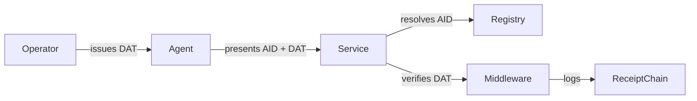

<div align="center">

# IDProva

**Verifiable identity for the agent era**

[](https://github.com/techblaze-au/idprova/actions)
[](https://crates.io/crates/idprova-core)
[](LICENSE)
[](docs/protocol-spec-v0.1.md)

An open protocol for cryptographically verifiable identity, scoped delegation, and tamper-evident audit trails for autonomous AI agents.

</div>

---

## The Problem

AI agents are calling APIs, delegating to sub-agents, and accessing sensitive systems — but there's no standard way to know **which agent did what, with whose permission, and whether you can prove it**.

Existing identity systems (OAuth, API keys, SPIFFE) were designed for humans or workloads, not autonomous agents that delegate to other agents.

## Three Pillars

**Agent Identity Documents (AIDs)** — W3C DID-based cryptographic identities purpose-built for AI agents.

```
did:idprova:techblaze.com.au:kai
│   │       │                 └─ agent name
│   │       └─ domain (verification anchor)
│   └─ did method
└─ DID scheme
```

**Delegation Attestation Tokens (DATs)** — Signed, scoped, time-bounded, chainable permission tokens.

```
Operator → Agent A (full access) → Agent B (read-only, 1 hour, max 10 actions)
```

**Action Receipts** — Hash-chained, tamper-evident audit logs of every agent action.

## Quick Start

### Install

```bash
cargo install idprova-cli
```

### Generate a keypair

```bash
idprova keygen --output my-agent.key
# Creates: my-agent.key (private) + my-agent.key.pub (multibase public key)
```

### Create an Agent Identity Document

```bash
idprova aid create \
  --id "did:idprova:example.com:my-agent" \
  --name "My Agent" \
  --controller "did:idprova:example.com:operator" \
  --key my-agent.key
# Outputs my-agent.aid.json
```

### Register with the registry

```bash
curl -X PUT http://localhost:3000/v1/aid/example.com:my-agent \
  -H "Content-Type: application/json" \
  -d @my-agent.aid.json
```

### Issue a Delegation Token

```bash
idprova dat issue \
  --issuer "did:idprova:example.com:operator" \
  --subject "did:idprova:example.com:my-agent" \
  --scope "mcp:tool:filesystem:read" \
  --expires-in 24h \
  --key operator.key
```

### Verify a DAT

```bash
# Offline (with public key)
idprova dat verify <TOKEN> --key operator.key.pub --scope "mcp:tool:filesystem:read"

# Via registry
idprova dat verify <TOKEN> --registry http://localhost:3000 --scope "mcp:tool:filesystem:read"
```

## Architecture



## Trust Levels

| Level | Name | Verification | Use Case |
|-------|------|-------------|----------|
| L0 | Self-declared | None | Development, testing |
| L1 | Domain-verified | DNS TXT record | Production agents |
| L2 | Organisation-verified | CA-like process | Enterprise agents |
| L3 | Third-party audited | External audit | Regulated industries |
| L4 | Continuously monitored | Runtime monitoring | Critical infrastructure |

## Cryptography

| Purpose | Algorithm |
|---------|-----------|
| Signatures | Ed25519 |
| Hashing | BLAKE3 |
| Interop | SHA-256 |
| Post-Quantum | ML-DSA-65 (FIPS 204) — planned |

## Running the Registry

```bash
# From source
cargo run -p idprova-registry

# Docker
docker run -p 3000:3000 idprova/registry

# With admin key (production)
REGISTRY_ADMIN_PUBKEY=<hex-32-bytes> cargo run -p idprova-registry
```

Registry endpoints: `GET /health` · `GET /ready` · `GET /v1/meta` · `GET|PUT|DELETE /v1/aid/:id` · `GET /v1/aid/:id/key` · `POST /v1/dat/verify` · `POST /v1/dat/revoke` · `GET /v1/dat/revocations` · `GET /v1/dat/revoked/:jti`

## Workspace

```
crates/
  idprova-core/       # Core library (crypto, AID, DAT, receipts, trust, policy)
  idprova-verify/     # High-level verification utilities
  idprova-cli/        # Command-line tool
  idprova-registry/   # Registry server (Axum + SQLite)
  idprova-middleware/  # Tower/Axum DAT verification middleware
  idprova-mcp-demo/   # MCP protocol demo/integration
sdks/
  python/             # Python SDK (PyO3)
  typescript/         # TypeScript SDK (napi-rs)
docs/                 # Protocol specification and guides
```

## Documentation

- [Getting Started](docs/getting-started.md)
- [API Reference](docs/api-reference.md)
- [Core Library API](docs/core-api.md)
- [Protocol Concepts](docs/concepts.md)
- [Security Model](docs/security.md)
- [Protocol Specification](docs/protocol-spec-v0.1.md)

## Compliance

| Framework | Controls | IDProva Component |
|-----------|----------|-------------------|
| NIST 800-53 | AU-2, AU-3, AU-8, AU-9, AU-10, AU-12, IA-2, AC-6 | Receipts, AIDs, DATs |
| Australian ISM | Agent identity, access control, audit logging | All three pillars |
| SOC 2 | CC6.1, CC6.3, CC7.2 | DATs, Receipts |

## License

Apache 2.0 — see [LICENSE](LICENSE) for details.

---

<div align="center">

Built by [Tech Blaze Consulting](https://techblaze.com.au) · Apache 2.0

</div>
