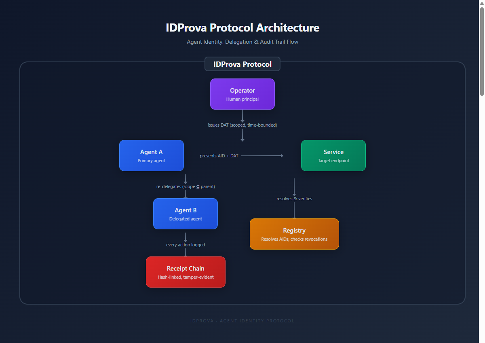
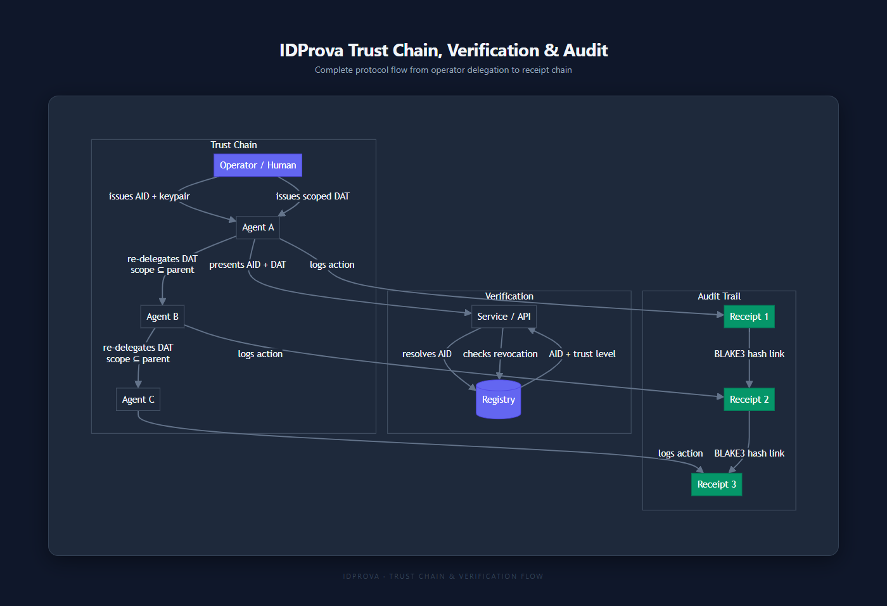

<div align="center">

<h1>IDProva</h1>

<h3>Cryptographic identity for AI agents</h3>

<p>An open protocol for verifiable identity, scoped delegation, and tamper-evident audit trails — purpose-built for autonomous AI agents.</p>

[](https://github.com/techblaze-au/idprova/actions)
[](https://crates.io/crates/idprova-core)
[](https://pypi.org/project/idprova/)
[](https://www.npmjs.com/package/@idprova/core)
[](https://docs.rs/idprova-core)
[](LICENSE)
[](docs/protocol-spec-v0.1.md)

[Documentation](https://idprova.dev) | [Getting Started](docs/getting-started.md) | [Protocol Spec](docs/protocol-spec-v0.1.md) | [API Reference](docs/api-reference.md)

</div>

---

## Why IDProva?

AI agents are calling APIs, delegating tasks to sub-agents, and accessing sensitive systems. But today's identity infrastructure was built for humans and static workloads — not autonomous software that spawns other autonomous software.

**The problem:** There is no standard way to answer three critical questions about AI agent activity:

- **Who** is this agent, and can I cryptographically prove it?
- **What** is it allowed to do, and who granted that permission?
- **What did it do**, and can I verify that audit trail hasn't been tampered with?

OAuth tokens don't chain. API keys can't scope. SPIFFE wasn't designed for delegation hierarchies. None of them produce tamper-evident audit logs.

**IDProva solves this** with three cryptographic primitives designed specifically for the agent era:

| Primitive | Purpose |
|-----------|---------|
| **Agent Identity Documents (AIDs)** | W3C DID-based identity bound to Ed25519 keys |
| **Delegation Attestation Tokens (DATs)** | Signed, scoped, time-bounded, chainable permission tokens |
| **Action Receipts** | Hash-chained, tamper-evident audit log of every agent action |

## Quick Install

```bash
# Rust (CLI + core library)
cargo install idprova-cli

# Python SDK (PyO3 bindings)
pip install idprova

# TypeScript SDK (napi-rs bindings)
npm install @idprova/core
```

## 60-Second Quickstart

### CLI: generate keys, create identity, issue delegation

```bash
# 1. Generate an Ed25519 keypair
idprova keygen --output operator.key

# 2. Create an Agent Identity Document
idprova aid create \
  --id "did:aid:example.com:my-agent" \
  --name "My Agent" \
  --controller "did:aid:example.com:operator" \
  --key operator.key

# 3. Issue a scoped delegation token (read-only, 24h expiry)
idprova dat issue \
  --issuer "did:aid:example.com:operator" \
  --subject "did:aid:example.com:my-agent" \
  --scope "mcp:tool:filesystem:read" \
  --expires-in 24h \
  --key operator.key

# 4. Verify the token
idprova dat verify <TOKEN> --key operator.key.pub --scope "mcp:tool:filesystem:read"
```

### Rust: programmatic usage

```rust
use idprova_core::crypto::KeyPair;
use idprova_core::aid::AidBuilder;
use idprova_core::dat::Dat;
use chrono::{Utc, Duration};

// Generate keys
let keypair = KeyPair::generate();

// Create an Agent Identity Document
let aid = AidBuilder::new()
    .id("did:aid:example.com:my-agent")
    .controller("did:aid:example.com:operator")
    .name("My Agent")
    .add_ed25519_key(&keypair)
    .build()?;

// Issue a Delegation Attestation Token
let dat = Dat::issue(
    "did:aid:example.com:operator",   // issuer
    "did:aid:example.com:my-agent",   // subject
    vec!["mcp:tool:filesystem:read".into()],
    Utc::now() + Duration::hours(24),     // expiry
    None,                                  // constraints
    None,                                  // config attestation
    &keypair,
)?;

// Serialize to compact JWS
let token = dat.to_compact()?;

// Verify: signature + timing + scope in one call
let pub_bytes = keypair.public_key_bytes();
dat.verify(&pub_bytes, "mcp:tool:filesystem:read", &Default::default())?;
```

> **Managed cloud registry coming Q2 2026.** Self-host today, or [join early access](https://idprova.dev/early-access) for the managed service.

## Architecture





```
Workspace Layout
─────────────────
crates/
  idprova-core/        Core library (crypto, AID, DAT, receipts, trust, policy)
  idprova-verify/      High-level verification utilities
  idprova-cli/         Command-line tool
  idprova-registry/    Registry server (Axum + SQLite)
  idprova-middleware/  Tower/Axum DAT verification middleware
  idprova-mcp-demo/    MCP protocol integration demo
sdks/
  python/              Python SDK (PyO3)
  typescript/          TypeScript SDK (napi-rs)
docs/                  Protocol specification and guides
```

## DID Method

IDProva uses a W3C DID-compatible identifier scheme:

```
did:aid:techblaze.com.au:kai
│   │       │                 └─ agent name
│   │       └─ domain (verification anchor)
│   └─ did method
└─ DID scheme
```

## Scope System

Delegation scopes follow a hierarchical `namespace:category:resource:action` pattern with wildcard support:

```
mcp:tool:filesystem:read        # specific permission
mcp:tool:filesystem:*           # all filesystem actions
mcp:*:*:*                       # full MCP access
api:service:billing:read        # custom namespace
```

Scopes are **subtractive** — a re-delegated token can only narrow permissions, never widen them.

## Comparison: Agent Identity Solutions

| Capability | **IDProva** | OAuth 2.0 | SPIFFE | mTLS | API Keys |
|---|---|---|---|---|---|
| Agent-to-agent delegation | Chainable DATs | No native chaining | No | No | No |
| Scoped permissions | Hierarchical scopes | Coarse scopes | No scopes | No scopes | All-or-nothing |
| Time-bounded access | Per-token expiry | Refresh tokens | Cert rotation | Cert expiry | Manual rotation |
| Tamper-evident audit | Hash-chained receipts | No | No | No | No |
| Delegation depth limits | Configurable per-token | N/A | N/A | N/A | N/A |
| Offline verification | Ed25519 signature check | Requires auth server | Requires SPIRE | CA required | Requires server |
| Post-quantum ready | ML-DSA-65 planned | No | No | No | No |
| Purpose-built for agents | Yes | No (human-centric) | No (workload-centric) | No (transport) | No |

## Trust Levels

| Level | Name | Verification | Use Case |
|-------|------|-------------|----------|
| L0 | Self-declared | None | Development, testing |
| L1 | Domain-verified | DNS TXT record | Production agents |
| L2 | Organisation-verified | CA-like process | Enterprise agents |
| L3 | Third-party audited | External audit | Regulated industries |
| L4 | Continuously monitored | Runtime monitoring | Critical infrastructure |

## Cryptography

| Purpose | Algorithm | Status |
|---------|-----------|--------|
| Signatures | Ed25519 | Stable |
| Hashing | BLAKE3 | Stable |
| Interop hashing | SHA-256 | Stable |
| Key zeroing | Zeroize on drop | Stable |
| Post-quantum | ML-DSA-65 (FIPS 204) | Planned |

## Running the Registry

```bash
# From source
cargo run -p idprova-registry

# Docker
docker run -p 3000:3000 idprova/registry

# Production (with admin key)
REGISTRY_ADMIN_PUBKEY=<hex-32-bytes> cargo run -p idprova-registry
```

**Endpoints:** `GET /health` | `GET /ready` | `GET /v1/meta` | `GET|PUT|DELETE /v1/aid/:id` | `GET /v1/aid/:id/key` | `POST /v1/dat/verify` | `POST /v1/dat/revoke` | `GET /v1/dat/revocations` | `GET /v1/dat/revoked/:jti`

## Compliance Mapping

| Framework | Relevant Controls | IDProva Component |
|-----------|------------------|-------------------|
| NIST 800-53 | AU-2, AU-3, AU-8, AU-9, AU-10, AU-12, IA-2, AC-6 | Receipts, AIDs, DATs |
| Australian ISM | Agent identity, access control, audit logging | All three pillars |
| SOC 2 | CC6.1, CC6.3, CC7.2 | DATs, Receipts |

## Documentation

Full documentation, guides, and the protocol specification are available at **[idprova.dev](https://idprova.dev)**.

- [Getting Started](docs/getting-started.md)
- [Protocol Concepts](docs/concepts.md)
- [Core Library API](docs/core-api.md)
- [API Reference](docs/api-reference.md)
- [Security Model](docs/security.md)
- [Protocol Specification](docs/protocol-spec-v0.1.md)

## License

Apache 2.0 — see [LICENSE](LICENSE) for details.

---

<div align="center">

Built by [Tech Blaze Consulting](https://techblaze.com.au) | [idprova.dev](https://idprova.dev)

</div>
