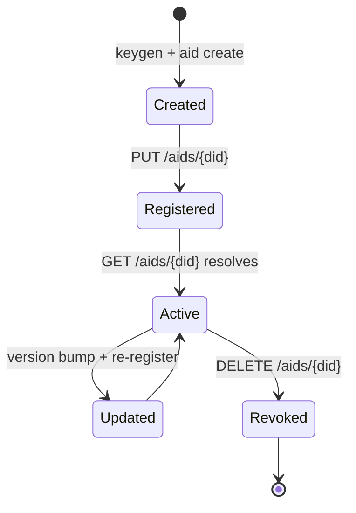
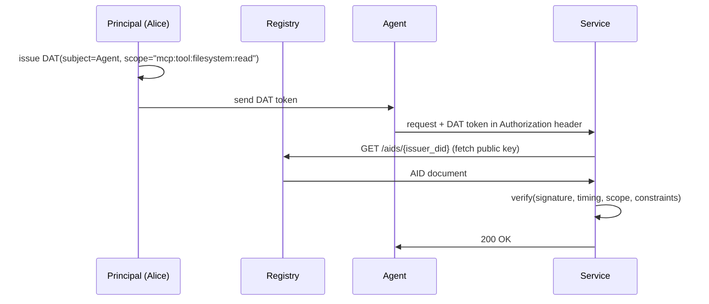
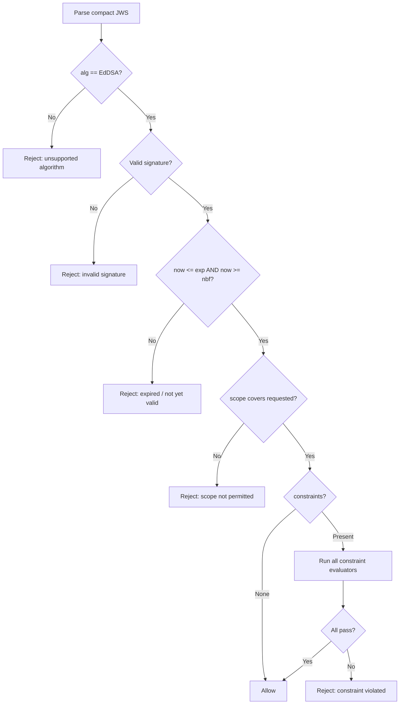
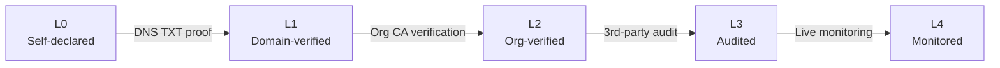
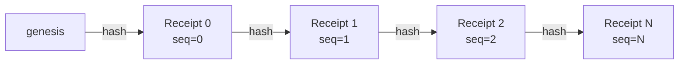
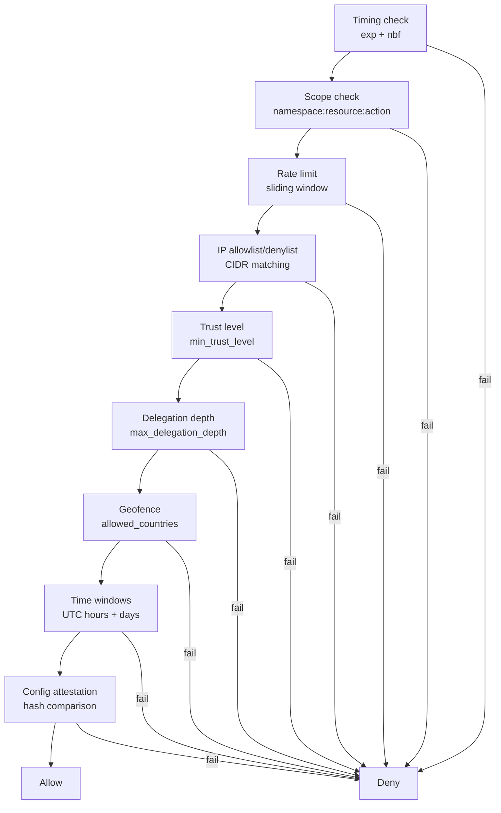
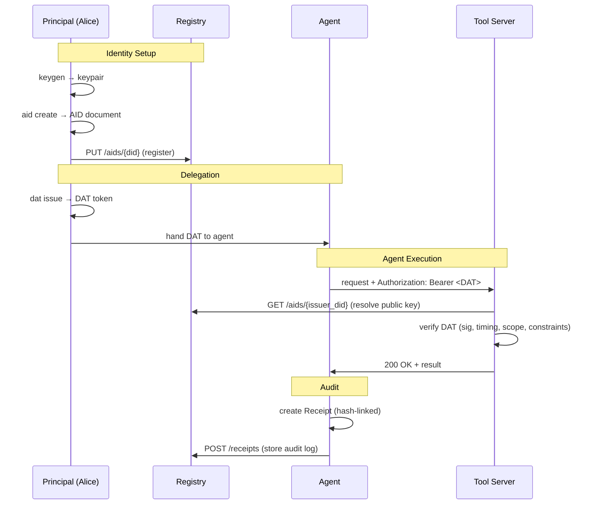

# IDProva Protocol Concepts

This guide explains the core concepts behind the IDProva protocol. For API details see [core-api.md](core-api.md). For the full specification see [protocol-spec-v0.1.md](protocol-spec-v0.1.md).

---

## Overview

IDProva is built on three pillars:

```mermaid
graph TB
    subgraph IDProva Protocol
        ID[Identity<br/>DID Documents]
        DEL[Delegation<br/>Attestation Tokens]
        AUD[Audit<br/>Action Receipts]
    end
    subgraph Cryptographic Foundation
        CRYPTO[Ed25519 · ML-DSA-65 · BLAKE3]
    end
    subgraph Protocol Bindings
        BINDINGS[MCP · A2A · HTTP]
    end
    ID --> CRYPTO
    DEL --> CRYPTO
    AUD --> CRYPTO
    IDProva Protocol --> BINDINGS
```

| Pillar | What it answers |
|--------|----------------|
| **Identity** — Agent Identity Documents (AIDs) | "Who is this agent?" |
| **Delegation** — Delegation Attestation Tokens (DATs) | "What is this agent allowed to do?" |
| **Audit** — Hash-chained Action Receipts | "What did this agent do?" |

---

## The `did:idprova` DID Method

Every agent in IDProva is identified by a **Decentralized Identifier (DID)** following the W3C DID Core specification. IDProva defines the `did:idprova:` method.

### DID format

```
did:idprova:<authority>:<agent-name>

Examples:
  did:idprova:example.com:kai-lead-agent
  did:idprova:techblaze.com.au:registry-agent
  did:idprova:localhost:dev-agent-01
```

- **Authority** — the domain or org ID of the namespace owner. For L1+ trust, this must be a domain the controller can prove via DNS TXT record.
- **Agent name** — locally unique within the authority namespace. Must match `[a-z0-9][a-z0-9_-]*`, max 256 chars total for the full DID.

### Reserved agent names

| Name | Purpose |
|------|---------|
| `_registry` | Namespace registry agent |
| `_admin` | Administrative operations |
| `_root` | Root identity for the namespace |

---

## Agent Identity Documents (AIDs)

An AID is a valid **W3C DID Document** with IDProva-specific extensions. It is the root of trust for an agent — containing its public keys, metadata, and trust level.

### AID lifecycle



### AID Document structure

```json
{
  "@context": [
    "https://www.w3.org/ns/did/v1",
    "https://idprova.dev/v1"
  ],
  "id": "did:idprova:example.com:my-agent",
  "controller": "did:idprova:example.com:alice",
  "verificationMethod": [{
    "id": "#key-ed25519",
    "type": "Ed25519VerificationKey2020",
    "controller": "did:idprova:example.com:my-agent",
    "publicKeyMultibase": "z6MkhaXgBZDvotDkL5..."
  }],
  "authentication": ["#key-ed25519"],
  "service": [{
    "id": "#idprova-metadata",
    "type": "IdprovaAgentMetadata",
    "serviceEndpoint": {
      "name": "My Agent",
      "model": "acme-ai/agent-v2",
      "runtime": "myruntime/v1",
      "trustLevel": "L1",
      "configAttestation": "blake3:abcdef..."
    }
  }],
  "trustLevel": "L1",
  "version": 1,
  "created": "2026-03-07T00:00:00Z",
  "updated": "2026-03-07T00:00:00Z"
}
```

### Required fields

| Field | Required | Notes |
|-------|----------|-------|
| `id` | Yes | The agent's DID |
| `controller` | Yes | Controlling entity's DID |
| `verificationMethod` | Yes | At least one Ed25519 key |
| `authentication` | Yes | Key ID references |
| `service[IdprovaAgentMetadata].name` | Yes | Human-readable name |

### Config attestation

The `configAttestation` field is a BLAKE3 or SHA-256 hash of the agent's configuration at a point in time. It allows verifiers to detect **configuration drift** — if an agent's running config no longer matches the hash in its AID, its DATs can be programmatically rejected.

---

## Delegation Attestation Tokens (DATs)

A DAT is a **JWS (JSON Web Signature) compact token** that grants scoped permission from an issuer to a subject agent. It is the primary mechanism for controlled delegation.

### DAT flow



### DAT format

A DAT is a compact JWS string: `base64url(header).base64url(claims).base64url(signature)`

**Header:**

```json
{
  "alg": "EdDSA",
  "typ": "idprova-dat+jwt",
  "kid": "did:idprova:example.com:alice#key-ed25519"
}
```

**Claims:**

```json
{
  "iss": "did:idprova:example.com:alice",
  "sub": "did:idprova:example.com:my-agent",
  "iat": 1741305600,
  "exp": 1741392000,
  "nbf": 1741305600,
  "jti": "dat_01JP4X7KZMA8VQHFNFZK3B0NRY",
  "scope": ["mcp:tool:filesystem:read", "mcp:tool:filesystem:write"],
  "constraints": {
    "maxCallsPerHour": 500,
    "maxDelegationDepth": 1
  }
}
```

### Scope grammar

Scopes follow a strict 4-part `namespace:protocol:resource:action` grammar:

```
mcp:tool:filesystem:read       # MCP filesystem tool read access
mcp:tool:filesystem:write      # MCP filesystem tool write access
mcp:resource:data:read         # MCP resource access
a2a:agent:billing:execute      # A2A agent execution
idprova:registry:aid:write     # registry write permission
```

Wildcards are allowed at any segment:

```
mcp:tool:filesystem:*    # all actions on filesystem tool
mcp:tool:*:*             # all MCP tools, any action
mcp:*:*:*                # all MCP resources and actions
*:*:*:*                  # unrestricted (use with caution)
```

A DAT's scope set **covers** a requested scope if any granted scope matches exactly or via wildcard. For example, `mcp:*:*:*` covers `mcp:tool:filesystem:read`.

### DAT verification pipeline

When a verifier receives a DAT, it runs these checks in order — short-circuiting on first failure:



### Delegation chains

An agent that holds a DAT may re-delegate a **subset** of its permissions to a sub-agent by issuing a new DAT. The `delegationChain` claim tracks the parent DAT JTIs:

```
Alice (root)
  └── DAT(scope=mcp:*:*:*, depth_max=2) → Agent A
        └── DAT(scope=mcp:tool:*:read, depth=1) → Agent B
              └── DAT(scope=mcp:tool:*:read, depth=2) → Agent C
                    └── Blocked: max_delegation_depth=2
```

Rules:
- A sub-DAT's scope must be a **subset** of the parent DAT's scope.
- The `max_delegation_depth` constraint propagates — the strictest value in the chain wins.
- Each re-delegation increments the chain depth.

---

## Trust Levels (L0–L4)

Trust levels are ordinal values indicating how thoroughly an agent's identity has been verified. They inform policy decisions but do not enforce them — verifiers choose which levels they accept.

| Level | Name | How earned |
|-------|------|-----------|
| **L0** | Self-declared | Agent claims identity with no verification |
| **L1** | Domain-verified | DNS TXT record proves domain ownership |
| **L2** | Organisation-verified | CA-like verification of controlling entity |
| **L3** | Audited | Third-party security audit completed |
| **L4** | Continuously monitored | Real-time behaviour analysis and compliance |

### Trust progression



Trust is:
- **Directional** — A may trust B at L2 while B trusts A at L1.
- **Contextual** — An agent may have different trust for different scopes.
- **Temporal** — Trust levels can be elevated or revoked.

### Using trust levels in DATs

A DAT constraint can enforce a minimum trust level on whoever presents the token:

```rust
DatConstraints {
    required_trust_level: Some("L2".into()), // requires L2+
    ..Default::default()
}
```

The verifier supplies the presenter's trust level via `EvaluationContext`.

---

## Action Receipts and Receipt Chains

Every significant action performed by an agent produces a signed **Action Receipt**. Receipts are linked into a **hash chain** — each receipt contains the BLAKE3 hash of the previous — making the log tamper-evident.

### Receipt structure

```json
{
  "id": "rcpt_01JP4X7...",
  "timestamp": "2026-03-07T12:34:56Z",
  "agent": "did:idprova:example.com:my-agent",
  "dat": "dat_01JP4X7...",
  "action": {
    "type": "mcp:tool-call",
    "server": "tools.example.com",
    "tool": "read_file",
    "inputHash": "blake3:aabb...",
    "outputHash": "blake3:ccdd...",
    "status": "success",
    "durationMs": 42
  },
  "context": {
    "sessionId": "sess_xyz",
    "requestId": "req_abc"
  },
  "chain": {
    "previousHash": "blake3:eeff...",
    "sequenceNumber": 7
  },
  "signature": "base64url..."
}
```

### Hash chain integrity



- Receipt 0: `chain.previousHash = "genesis"`, `sequenceNumber = 0`
- Receipt N: `chain.previousHash = blake3(Receipt N-1)`, `sequenceNumber = N`

Tampering with any receipt breaks the hash link — detectable by `ReceiptLog::verify_integrity()`.

### Linking receipts to DATs

The `dat` field in each receipt references the `jti` of the DAT that authorised the action. This creates a complete audit trail:

```
Principal (Alice)
  └── DAT(jti="dat_X", scope="mcp:tool:filesystem:read")
        └── Receipt(dat="dat_X", action="read_file", seq=0)
        └── Receipt(dat="dat_X", action="read_file", seq=1)
```

A compliance auditor can reconstruct the full chain of authority for any action: Principal → DAT → Receipt.

---

## Policy Engine

The RBAC policy engine evaluates whether a request is permitted under a given DAT. It combines scope checking, timing validation, and 7 pluggable constraint evaluators.

### Evaluation order



Short-circuits on first denial. Custom evaluators can be plugged in via `PolicyEvaluator::with_evaluators()`.

### Constraint evaluators

| # | Evaluator | Constraint fields | Context fields |
|---|-----------|------------------|----------------|
| 1 | Rate limit | `maxCallsPerHour`, `maxCallsPerDay`, `maxConcurrent` | `actions_this_hour`, `actions_this_day`, `active_concurrent` |
| 2 | IP constraint | `allowedIPs`, `deniedIPs` | `source_ip` |
| 3 | Trust level | `requiredTrustLevel` | `caller_trust_level` |
| 4 | Delegation depth | `maxDelegationDepth` | `delegation_depth` |
| 5 | Geofence | `geofence` | `source_country` |
| 6 | Time windows | `timeWindows` | `timestamp` |
| 7 | Config attestation | `requiredConfigAttestation` | `caller_config_attestation` |

---

## Putting It All Together

A complete IDProva interaction:



---

## See also

- [Getting Started Guide](getting-started.md) — hands-on CLI walkthrough
- [API Reference](api-reference.md) — registry HTTP endpoints
- [Core Library API](core-api.md) — Rust API with code examples
- [Security Model](security.md) — threat model, crypto choices, key management
- [Protocol Specification](protocol-spec-v0.1.md) — complete formal spec
